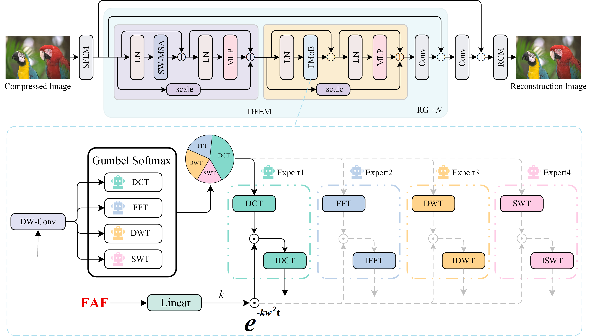
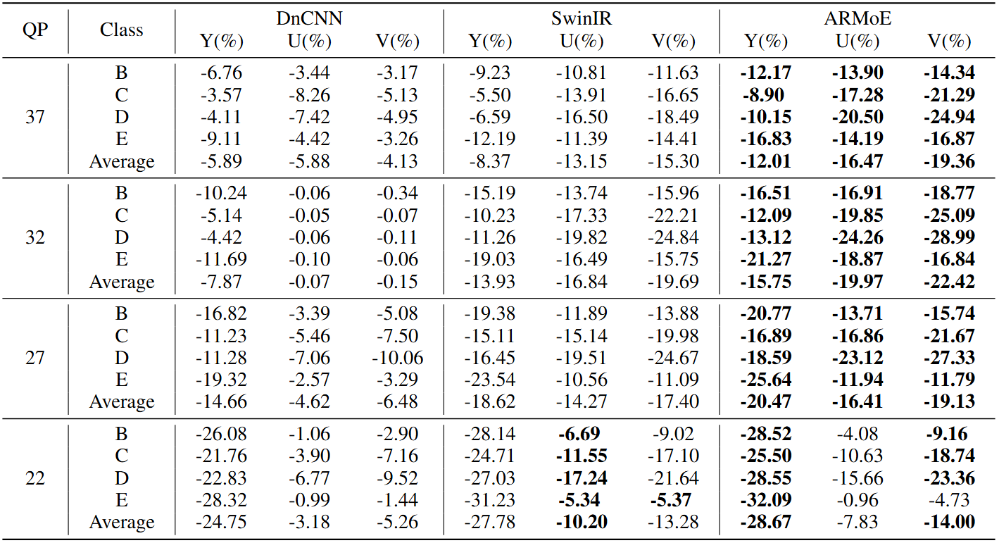

# Compression Artifacts Removal based on Frequency Domain Mixture of Experts

---

> **Abstract:** *In recent years, lossy compression standards such as H.264/AVC, H.265/HEVC and H.266/VVC have been proposed and widely applied in image and video encoding. However, these compression algorithms inevitably introduce various complex types of compression artifacts, which severely degrade image quality. Although existing methods have attempted to remove artifacts through filter design or probabilistic prior modeling, they are often effective only for specific types of artifacts, lacking generalization and adaptability. To address this, we propose a novel image compression artifact removal model: ARMoE, which combines multiple frequency-domain transformations with the MoE (Mixture of Experts). Considering the frequency distribution and energy distribution differences of images, we introduce various frequency-domain transformations as expert branches and use a sparse activation mechanism to adaptively select the optimal frequency-domain expert to suppress compression artifacts, achieving an efficient artifact removal method. Furthermore, we re-encode and decode multiple high-quality datasets, including DF2K and Kodak24, using the VTM-20.0 codec under the VVC standard, constructing a more challenging artifact dataset. We conducted rigorous comparative experiments with current state-of-the-art image restoration methods, and the results demonstrate that ARMoE exhibits outstanding image restoration capability.* 




---


## Visual Results On Compression Artifacts Removal


---


## Environment and Installation

- Python 3.8
- PyTorch >= 1.8.0
- NVIDIA GPU + [CUDA](https://developer.nvidia.com/cuda-downloads)

```bash
pip install -r requirements.txt
python setup.py develop
```

---


## Datasets

Used training and testing sets can be downloaded as follows:

|                Task                |                         Training Set                         |                         Testing Set                          |
| :--------------------------------: | :----------------------------------------------------------: | :----------------------------------------------------------: |
|   Compression Artifacts Removal    | DIV2K (900 training images) + Flickr2K (2650 images) [complete training dataset DF2K: [Baidu Disk](https://pan.baidu.com/s/1KIcPNz3qDsGSM0uDKl4DRw?pwd=74yc)] | Kodak24 + McMaster + CBSD68 [complete testing dataset: [Google Drive](https://drive.google.com/drive/folders/1M8i9o_wqq3IOf0nwB-36Wk_hmFfZUX8N) / [Baidu Disk](https://pan.baidu.com/s/1Tf8WT14vhlA49TO2lz3Y1Q?pwd=8xen)] |
| Lightweight Image Super-Resolution | [DIV2K](https://data.vision.ee.ethz.ch/cvl/DIV2K/) (900 training images) [complete dataset DF2K [download](https://drive.google.com/file/d/1TubDkirxl4qAWelfOnpwaSKoj3KLAIG4/view?usp=share_link)] | Set5 + BSD100 [complete testing dataset: [download](https://drive.google.com/file/d/1n-7pmwjP0isZBK7w3tx2y8CTastlABx1/view?usp=sharing)] |

---


## Models

| Method      | Params |                          Model Zoo                           |
| :---------- | :----: | :----------------------------------------------------------: |
| ARMoE       | 25.6M  | [Google Drive](https://drive.google.com/drive/folders/15CG48tVXHPcHiUwMXa6YLu8E1oieppnO) / [Baidu Disk](https://pan.baidu.com/s/1lHctUi9xPa9ConZ9j8cUbA?pwd=w5gi) |
| ARMoE-light |  845K  | [Google Drive](https://drive.google.com/drive/folders/14VG5mw5ie8RrR4jjypeHynXDZYWL8w-r?usp=drive_link) / [Baidu Disk](https://pan.baidu.com/s/1rgkCyqEJdZlHvQ6_Dwb3rA?pwd=4rfr) |

---


## Training

- Run the following scripts. The training configuration is in `options/Train/`.

  ```shell
  # Compression Artifacts Removal
  python basicsr/train.py -opt options/Train/CAR/train_ARMoE_QP22.yml
  python basicsr/train.py -opt options/Train/CAR/train_ARMoE_QP27.yml
  python basicsr/train.py -opt options/Train/CAR/train_ARMoE_QP32.yml
  python basicsr/train.py -opt options/Train/CAR/train_ARMoE_QP37.yml
  
  # Lightweight Image Super-Resolution
  python basicsr/train.py -opt options/Train/SR/train_ARMoE_lightSRx2.yml
  ```

- The training experiment is in `experiments/`.


## Testing

- Download the pre-trained models and place them in `experiments/pretrained_models/`.

  We provide pre-trained models for Compression Artifacts Removal and Lightweight Image Super-Resolution: ARMoE (QP22, QP27, QP32, QP37) and ARMoE-light (x2).

- Download testing (Set5, BSD100) datasets, place them in `datasets/`.

- Run the following scripts. The testing configuration is in `options/Test/` .

  ```shell
  # Compression Artifacts Removal
  python basicsr/test.py -opt options/Test/CAR/test_ARMoE_QP22.yml
  python basicsr/test.py -opt options/Test/CAR/test_ARMoE_QP27.yml
  python basicsr/test.py -opt options/Test/CAR/test_ARMoE_QP32.yml
  python basicsr/test.py -opt options/Test/CAR/test_ARMoE_QP37.yml
  
  # Lightweight Image Super-Resolution
  python basicsr/test.py -opt options/Test/SR/test_ARMoE_lightSRx2.yml
  ```
  
- The output is in `results/`.

---


## Results
<details>
<summary>Ablation Study</summary>
<p align="center">
  
</p>
</details>


<details>
<summary>Comparison on VVC Compression Artifacts Removal</summary>
<p align="center">
  
</p>
</details>


<details>
<summary>Comparison on BD-Rate Reduction</summary>
<p align="center">
  
</p>
</details>


<details>
<summary>Comparison on Lightweight Image Super-Resolution</summary>
<p align="center">
  
</p>
</details>

---


## Acknowledgements

This code is built on  [BasicSR](https://github.com/XPixelGroup/BasicSR).
